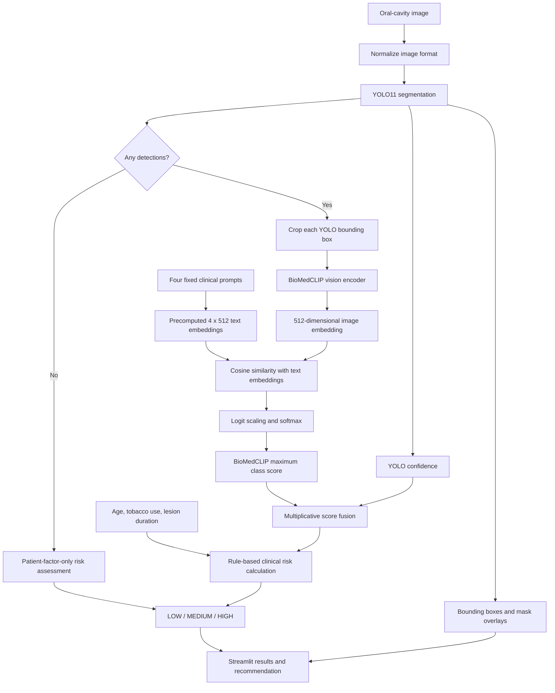

# OncoEdge — Edge AI Oral Lesion Screening Research Prototype

OncoEdge is a research prototype for local, image-assisted oral lesion screening on resource-constrained edge hardware. It combines lesion detection and segmentation, zero-shot biomedical image classification, patient risk factors, and a simple referral-oriented interface.

The project targets the **NVIDIA Jetson Nano 4 GB** and explores how a large biomedical vision-language model can be reduced to a practical edge-deployment pipeline.

> [!CAUTION]
> OncoEdge is an engineering and research prototype. It is **not a medical device**, does not provide a diagnosis, and has not been clinically validated. Its output must not replace examination, biopsy, or judgement by a qualified healthcare professional.

## Project status

The repository contains working pipeline code as well as experiments and deployment work that are not yet merged or reproducibly packaged on the default branch. The labels below are used throughout this README.

| Label | Meaning |
|---|---|
| **Implemented** | Connected to the executable code on `main` |
| **Branch-only** | Present on another repository branch, not on `main` |
| **Generated artifact required** | Code exists, but a model, dataset, or engine must be supplied or generated |
| **Expected** | Design target or estimate, not a measured result in this repository |
| **Not yet verified** | No retained artifact or reproducible result proves the claim |

| Capability | Status | Current evidence |
|---|---|---|
| Streamlit screening interface | **Implemented** | [`streamlit_app.py`](streamlit_app.py) |
| YOLO detection and segmentation wrapper | **Implemented** | [`src/models/yolo_detector.py`](src/models/yolo_detector.py) |
| BioMedCLIP zero-shot classifier | **Implemented** | [`src/models/biomedclip_classifier.py`](src/models/biomedclip_classifier.py) |
| Per-lesion classification and score fusion | **Implemented** | [`src/pipeline/inference_pipeline.py`](src/pipeline/inference_pipeline.py) |
| Patient-factor risk stratification | **Implemented** | [`src/pipeline/decision_tree.py`](src/pipeline/decision_tree.py) |
| Fine-tuned oral-lesion YOLO11s-seg | **Branch-only** | [`develop_yolo_ft`](https://github.com/arnavp27/OncoEdge-Jetson/tree/develop_yolo_ft) |
| Vision-only BioMedCLIP ONNX export | **Generated artifact required** | Export script exists; ONNX files are not committed |
| TensorRT mixed INT8/FP16 backend | **Generated artifact required** | Builder and runtime wrapper exist; engine is not committed |
| Jetson Nano engine size and latency | **Not yet verified** | Documentation contains expectations and sample output, but no retained engine or benchmark JSON |
| Clinical diagnostic performance | **Not yet verified** | No clinical or external test-set evaluation is committed |

## What OncoEdge does

The interface accepts an oral-cavity photograph and three patient inputs:

- age;
- years of tobacco use; and
- lesion duration.

For every region detected by YOLO, the current pipeline crops the bounding box, classifies the crop using BioMedCLIP, fuses the detector and classifier scores, and applies a rule-based risk calculation. The interface returns:

- detected regions and optional segmentation overlays;
- one BioMedCLIP class per region;
- per-class relative scores;
- a fused confidence score;
- a `LOW`, `MEDIUM`, or `HIGH` risk level; and
- a referral-oriented recommendation.

### End-to-end architecture



### Runtime data flow

1. **Image preparation** — PIL or NumPy input is converted to RGB.
2. **Detection** — YOLO processes the full image at a default input size of `640` with confidence threshold `0.25`.
3. **Cropping** — each valid bounding box becomes a lesion candidate. The mask is retained for visualization but is not used to mask the classifier crop.
4. **Classification** — BioMedCLIP compares the crop with four fixed text prompts.
5. **Fusion** — `fusion_score = yolo_confidence × biomedclip_max_score`.
6. **Risk assessment** — the maximum fused lesion score is combined with patient factors.
7. **Presentation** — Streamlit displays the risk level, recommendation, detected regions, and score breakdown.

## Models

### 1. YOLO11 segmentation

The default branch instantiates Ultralytics with:

```text
yolo11n-seg.pt, confidence=0.25, image size=640
```

This filename normally resolves to the generic Ultralytics pretrained checkpoint. The default branch does **not** contain or select the project's fine-tuned oral-lesion model. Consequently, a fresh `main` checkout demonstrates the pipeline structure but should not be represented as a validated oral-lesion detector.

The fine-tuning branch uses **YOLO11s-seg**, image size `512`, batch size `4`, and three annotated lesion classes:

| ID | Class | Meaning |
|---:|---|---|
| 0 | OCA | Oral cancer, represented as squamous cell carcinoma in the training notes |
| 1 | OPMD | Oral potentially malignant disorder |
| 2 | Benign | Benign oral lesions |

Healthy images are included as background-only negative samples. This work and its training outputs are available on [`develop_yolo_ft`](https://github.com/arnavp27/OncoEdge-Jetson/tree/develop_yolo_ft), but the fine-tuned checkpoint is not integrated into `main`.

### 2. BioMedCLIP

The classifier uses Microsoft's [`BiomedCLIP-PubMedBERT_256-vit_base_patch16_224`](https://huggingface.co/microsoft/BiomedCLIP-PubMedBERT_256-vit_base_patch16_224), a biomedical vision-language foundation model with:

- a ViT-B/16 image encoder;
- a PubMedBERT text encoder;
- `224 × 224` image input;
- a text context length of `256` tokens; and
- a shared `512`-dimensional image/text embedding space.

On `main`, lesion candidates are compared with four prompts:

| Returned class | Fixed prompt |
|---|---|
| `OCA` | `clinical photograph of oral squamous cell carcinoma` |
| `OPMD` | `clinical photograph of oral leukoplakia white patch` |
| `Benign` | `clinical photograph of benign oral lesion aphthous ulcer` |
| `Normal` | `clinical photograph of normal oral mucosa` |

The `Normal` prompt provides a competing prototype for detector false positives. These four-way softmax outputs are relative similarities within a closed prompt set; they are **not calibrated probabilities of disease**.

## BioMedCLIP edge optimization

### The key idea: cache fixed text prototypes

The official BioMedCLIP checkpoint is approximately **784 MB** because it contains both the image encoder and the PubMedBERT text encoder. OncoEdge uses only four fixed text prompts, so recomputing their text features for every image is unnecessary.

The optimization pipeline runs the text encoder once, L2-normalizes each prompt embedding, and saves the result as a NumPy matrix:

```text
4 prompts × 512 dimensions × 4 bytes per float32
= 8,192 bytes of numerical data
= 128-byte NumPy header
= 8,320 bytes total (8.125 KiB)
```

At inference time, the system needs only the image encoder and this small prototype matrix. It computes:

```text
image_features = L2_normalize(vision_encoder(image))       # (1, 512)
text_features  = precomputed_text_embeddings              # (4, 512)
similarity     = image_features @ text_features.T          # (1, 4)
scores         = softmax(similarity × logit_scale)         # (1, 4)
```

This optimization removes the need to deploy and execute the full text encoder. It does **not** reduce the vector space from `768` to `512`: BioMedCLIP already projects both modalities into a `512`-dimensional shared space.

### Size progression

| Stage | Contents | Size | Status |
|---|---|---:|---|
| Full BioMedCLIP checkpoint | Vision encoder + PubMedBERT text encoder | ~784 MB | Official upstream file size |
| Vision-only FP32 ONNX | ViT vision path; fixed batch `1 × 3 × 224 × 224` | ~330 MB | Documented generated artifact; not committed |
| Cached text prototypes | Four normalized `float32[512]` vectors | 8,320 bytes | Exact expected NumPy size for current four-class script |
| TensorRT mixed-precision engine | Vision encoder with INT8 enabled and FP16 fallback | ~70–120 MB | **Expected**, not yet verified from a retained engine |

The documented vision-only conversion is approximately:

```text
(784 MB - 330 MB) / 784 MB × 100 = 57.9% reduction
784 MB / 330 MB = 2.38× smaller
```

If a future reproducible TensorRT build falls within the expected `70–120 MB` range, it would be approximately `84.7–91.1%` smaller than the full checkpoint. This range must remain an estimate until the engine, build environment, and benchmark report are retained.

### ONNX and TensorRT pipeline

The repository provides scripts for the following workflow:

1. Load the upstream BioMedCLIP checkpoint.
2. Export only `model.visual` to FP32 ONNX with fixed batch size `1` and output shape `(1, 512)`.
3. Precompute the four text embeddings.
4. Extract the model's learned logit-scale value.
5. Collect representative raw calibration images.
6. Build the engine on the target Jetson with entropy calibration.
7. Enable TensorRT INT8 plus FP16 fallback for layers that are not executed in INT8.
8. Compare TensorRT output and latency against the PyTorch path.

Calibration and runtime use the same preprocessing module to reduce calibration/inference drift:

- bicubic resize to `224 × 224`;
- conversion to RGB float32;
- CLIP mean and standard-deviation normalization; and
- channel-first `NCHW` layout.

> [!IMPORTANT]
> Enabling both TensorRT flags does not prove which individual layers execute in INT8 or FP16. A production claim requires inspection of the built engine and reproducible target-device measurements.

## Fusion and risk assessment

### Score fusion

The current `main` implementation uses multiplicative fusion:

```text
fusion_score = yolo_confidence × biomedclip_max_score
```

This treats YOLO as spatial evidence and BioMedCLIP as semantic evidence. It is simple and interpretable, but it can suppress the final score when either component is uncertain. The unmerged advanced branch explores a gate-style alternative.

### Rule-based risk score

The current clinical decision tree calculates:

```text
risk_score = fusion_score × 10
           + 1.5 if age > 40
           + 2.0 if tobacco use > 10 years
           + 1.5 if lesion duration > 6 weeks
```

| Risk level | Current rule | Interface recommendation |
|---|---|---|
| `HIGH` | score `> 8.0` | Urgent specialist referral within 2 weeks |
| `MEDIUM` | score `> 5.0` | Non-urgent referral within 4 weeks |
| `LOW` | score `≤ 5.0` | Routine monitoring |

These thresholds are software rules, not clinically validated cut-offs. The theoretical score can reach `15`, although the current UI formats it as `/10`; this known mismatch should be corrected before presenting the score to users.

## Dataset and fine-tuning evidence

The `develop_yolo_ft` branch contains metadata for **3,000 images** and **714 patients**:

| Image category | Count | Share |
|---|---:|---:|
| OPMD | 1,394 | 46.5% |
| Benign | 748 | 24.9% |
| Healthy | 729 | 24.3% |
| OCA | 129 | 4.3% |
| **Total** | **3,000** | **100%** |

The run was configured for 100 epochs with early-stopping patience of 15 and contains 72 logged epochs. Its best combined validation point appears at epoch 71:

| YOLO validation metric | Value |
|---|---:|
| Box precision | 0.617 |
| Box recall | 0.448 |
| Box mAP50 | 0.512 |
| Box mAP50–95 | 0.388 |
| Mask precision | 0.619 |
| Mask recall | 0.432 |
| Mask mAP50 | 0.477 |
| Mask mAP50–95 | 0.287 |

Sources: [`args.yaml`](https://github.com/arnavp27/OncoEdge-Jetson/blob/develop_yolo_ft/zenodo_DOAOC/yolo_finetune/oncoedge_v1/args.yaml) and [`results.csv`](https://github.com/arnavp27/OncoEdge-Jetson/blob/develop_yolo_ft/zenodo_DOAOC/yolo_finetune/oncoedge_v1/results.csv).

These values describe validation detection and segmentation performance for that training run. They are not end-to-end screening accuracy, sensitivity, specificity, or diagnostic performance.

The conversion script shuffles and splits individual images rather than grouping by patient. Because multiple images can belong to the same patient, patient leakage between training and validation is possible. A patient-level split is required before reporting generalization performance.

## Getting started

### What a fresh clone contains

A fresh `main` checkout contains source code and documentation, but it does not contain:

- a fine-tuned oral-lesion YOLO checkpoint;
- the downloaded BioMedCLIP checkpoint;
- precomputed text embeddings;
- the extracted logit-scale JSON;
- the vision-encoder ONNX files;
- calibration images;
- a TensorRT engine; or
- a clinical validation dataset.

The generic YOLO and upstream BioMedCLIP checkpoints can be downloaded automatically by their libraries when internet access is available. The remaining deployment artifacts must be generated.

### Development setup

Requirements:

- Python 3.10;
- Git;
- sufficient storage for the approximately 784 MB upstream checkpoint and generated artifacts; and
- CUDA-capable hardware for practical GPU inference, or CPU for limited development testing.

```bash
git clone https://github.com/arnavp27/OncoEdge-Jetson.git
cd OncoEdge-Jetson

python3.10 -m venv .venv
source .venv/bin/activate
python -m pip install --upgrade pip
python -m pip install -r requirements.txt
```

PowerShell activation on Windows:

```powershell
py -3.10 -m venv .venv
.\.venv\Scripts\Activate.ps1
python -m pip install --upgrade pip
python -m pip install -r requirements.txt
```

Run the interface:

```bash
streamlit run streamlit_app.py --server.port 8501 --server.address 0.0.0.0
```

Then open `http://localhost:8501`, enter the patient factors, upload an image, and select **Analyze Image**.

> [!WARNING]
> Without an integrated fine-tuned checkpoint, the default YOLO path is a software demonstration rather than an oral-lesion detector suitable for evaluation.

### Generate BioMedCLIP deployment artifacts

Run these commands from the repository root on a development machine:

```bash
# Four normalized text prototypes: models/biomedclip/text_embeddings.npy
python src/models/precompute_text_embeddings.py

# Learned temperature/logit scale: models/biomedclip/logit_scale.json
python src/models/extract_clip_logit_scale.py

# Fixed-shape FP32 vision encoder
python src/models/export_vision_encoder_onnx.py --opset 13
```

Prepare representative raw JPEG calibration data:

```bash
python src/utils/prepare_calibration_data.py \
  --source-dirs /path/to/representative/oral/images \
  --output-dir data/calibration_images \
  --count 300
```

The calibrator requires at least 100 JPEG images and recommends approximately 250–400. Calibration images should represent the intended camera, lighting, anatomy, lesion classes, and image-quality distribution. Do not evaluate accuracy on the calibration set.

### Jetson Nano 4 GB deployment

The TensorRT engine must be built on the target-compatible Jetson software stack. TensorRT engines are tied to hardware and software versions and should not be assumed portable between systems.

Before building, verify that the Jetson environment can import TensorRT and PyCUDA and that both ONNX files are present:

```bash
python3 -c "import tensorrt as trt; import pycuda.autoinit; print(trt.__version__)"
ls -lh models/biomedclip/onnx/vision_encoder.onnx*
ls -lh models/biomedclip/text_embeddings.npy models/biomedclip/logit_scale.json
```

Build the mixed INT8/FP16 vision engine:

```bash
python3 src/models/build_tensorrt_engine.py \
  --onnx models/biomedclip/onnx/vision_encoder.onnx \
  --calib-dir data/calibration_images \
  --output models/biomedclip/tensorrt/vision_encoder_int8.engine \
  --workspace 512
```

If the Nano runs out of memory, retry with `--workspace 256` or `--workspace 128`. This changes builder workspace allowance; it does not directly define the final engine size.

Validate against a separate test-image directory:

```bash
python3 tests/benchmark_tensorrt.py \
  --test-dir data/test_images \
  --warmup 10 \
  --iterations 100 \
  --output benchmark_results.json
```

Retain the following before publishing performance claims:

- engine file size and checksum;
- Jetson model and power mode;
- JetPack, CUDA, cuDNN, TensorRT, Python, and PyCUDA versions;
- calibration-set composition;
- independent test-set composition;
- latency definition, warm-up count, iteration count, and percentiles;
- PyTorch/ONNX/TensorRT output agreement; and
- accuracy before and after quantization.

The older Jetson documents in this repository were written across different implementation stages and contain Nano/Orin and TensorRT-version inconsistencies. Treat them as historical engineering notes and validate all commands against the target JetPack version.

## Repository layout

```text
OncoEdge-Jetson/
├── streamlit_app.py                    # User interface
├── src/
│   ├── config.py                       # Model, path, and clinical defaults
│   ├── models/
│   │   ├── yolo_detector.py            # Ultralytics detector wrapper
│   │   ├── biomedclip_classifier.py    # Full PyTorch/OpenCLIP classifier
│   │   ├── biomedclip_preprocess.py    # Shared TensorRT preprocessing
│   │   ├── precompute_text_embeddings.py
│   │   ├── extract_clip_logit_scale.py
│   │   ├── export_vision_encoder_onnx.py
│   │   ├── build_tensorrt_engine.py
│   │   └── biomedclip_tensorrt.py      # TensorRT runtime wrapper
│   ├── pipeline/
│   │   ├── inference_pipeline.py       # End-to-end orchestration
│   │   ├── fusion.py                   # Confidence fusion
│   │   └── decision_tree.py            # Risk rules
│   └── utils/
│       ├── prepare_calibration_data.py
│       └── visualization.py
├── tests/                              # Placeholder, ONNX, and benchmark scripts
├── data/                               # Metadata and ignored local image data
├── models/                             # Ignored generated/downloaded artifacts
├── QUANTIZATION_README.md              # Historical quantization progress notes
├── JETSON_DEPLOYMENT_GUIDE.md          # Historical deployment guide
└── IMPLEMENTATION_SUMMARY.md           # Historical implementation summary
```

## Branches

| Branch | Purpose | Relationship to `main` |
|---|---|---|
| [`main`](https://github.com/arnavp27/OncoEdge-Jetson/tree/main) | Original Streamlit, YOLO, BioMedCLIP, fusion, risk, and TensorRT scripts | Default branch documented by the runnable-path sections above |
| [`develop_yolo_ft`](https://github.com/arnavp27/OncoEdge-Jetson/tree/develop_yolo_ft) | Dataset conversion, YOLO11s-seg fine-tuning, training outputs, and Jetson export scripts | Not merged; contains the measured YOLO results reported above |
| [`deepak-advanced-pipeline`](https://github.com/arnavp27/OncoEdge-Jetson/tree/deepak-advanced-pipeline) | Backend registry, ONNX adapters, configurable fusion, metrics, feedback, and expanded tests | Newer experimental architecture; not merged or treated as `main` behavior |

## Testing status

| Test surface | Current status |
|---|---|
| Python syntax | Source files compile syntactically |
| YOLO unit tests | Placeholder tests on `main` |
| BioMedCLIP unit tests | Placeholder tests on `main` |
| Pipeline integration tests | Placeholder tests on `main` |
| ONNX equivalence tests | Implemented, but require uncommitted ONNX artifacts and upstream model access |
| TensorRT benchmark | Implemented as a script, but requires a compatible Jetson, engine, embeddings, logit scale, and test images |
| End-to-end clinical evaluation | Not present |

`test_components.py` is a smoke-test script, not a reliable automated pass/fail suite: it catches component exceptions and prints a final completion message regardless of individual failures.

## Known limitations

- `main` does not select the branch-only fine-tuned oral-lesion checkpoint.
- Required model, ONNX, calibration, TensorRT, and evaluation artifacts are not versioned.
- BioMedCLIP remains zero-shot for this task; it was not fine-tuned here on the oral dataset.
- Four-way softmax scores are prompt-relative similarities, not calibrated disease probabilities.
- The segmentation mask is visualized but not used to isolate pixels sent to BioMedCLIP.
- Multiplicative fusion and risk weights have not been clinically calibrated.
- The risk score can exceed the `/10` range displayed by the UI.
- The YOLO training split is image-level rather than demonstrably patient-level.
- The OCA class is substantially underrepresented relative to OPMD.
- No external validation, demographic subgroup analysis, uncertainty threshold, or abstention policy is available.
- No retained result demonstrates TensorRT size, speed, memory usage, thermal stability, or clinical accuracy on the Nano.
- The TensorRT wrapper and historical JetPack instructions must be reconciled for one confirmed TensorRT API version.
- The application does not implement authentication, encrypted storage, audit controls, or medical-data governance.

Microsoft's BioMedCLIP model card states that deployed use cases are out of scope for the upstream model. Any future clinical deployment would require independent validation, governance, security controls, regulatory review, and qualified clinical oversight.

## Roadmap

- [ ] Merge or deliberately port the fine-tuned YOLO work into the current architecture.
- [ ] Replace the generic detector default with an explicit, checksummed oral-lesion checkpoint.
- [ ] Rebuild the dataset split at patient level and publish deterministic split manifests.
- [ ] Evaluate detection and segmentation per class on an untouched test set.
- [ ] Evaluate the complete YOLO-to-BioMedCLIP pipeline rather than individual components alone.
- [ ] Generate and retain BioMedCLIP text embeddings, logit scale, ONNX metadata, and checksums.
- [ ] Build a version-compatible TensorRT engine on the Jetson Nano and retain the complete environment record.
- [ ] Benchmark size, latency, memory, thermals, output drift, and task accuracy reproducibly.
- [ ] Calibrate thresholds and introduce uncertainty handling or abstention.
- [ ] Correct the risk-score display range and unify class naming across code and visualization.
- [ ] Replace placeholder tests with isolated unit tests and artifact-aware integration tests.
- [ ] Obtain clinical review and define an ethics, privacy, and validation protocol before user studies.

## Responsible interpretation of results

Use these phrases:

- “oral-lesion screening research prototype”;
- “zero-shot similarity score”;
- “YOLO validation mAP on the fine-tuning branch”;
- “documented vision-only ONNX size”;
- “expected TensorRT target”; and
- “requires independent clinical validation.”

Avoid these unsupported phrases:

- “diagnoses oral cancer”;
- “clinically accurate”;
- “65–70% diagnostic accuracy”;
- “95.32 MB deployed engine” without retaining that engine;
- “4.11 FPS on Jetson Nano” without a reproducible benchmark; and
- “reduced the embedding dimension from 768 to 512.”

## Acknowledgements

OncoEdge builds on:

- [Microsoft BioMedCLIP](https://huggingface.co/microsoft/BiomedCLIP-PubMedBERT_256-vit_base_patch16_224) for biomedical vision-language representations;
- [Ultralytics YOLO](https://github.com/ultralytics/ultralytics) for detection and segmentation;
- [Hugging Face Hub](https://huggingface.co/) and [OpenCLIP](https://github.com/mlfoundations/open_clip) for model distribution and inference;
- [ONNX](https://onnx.ai/) for portable model representation;
- [NVIDIA TensorRT](https://developer.nvidia.com/tensorrt) and the Jetson platform for edge inference; and
- [Streamlit](https://streamlit.io/) for the local user interface.

## License

Repository source code is provided under the [MIT License](LICENSE). Upstream models, datasets, frameworks, and pretrained weights remain subject to their respective licenses and usage conditions.
